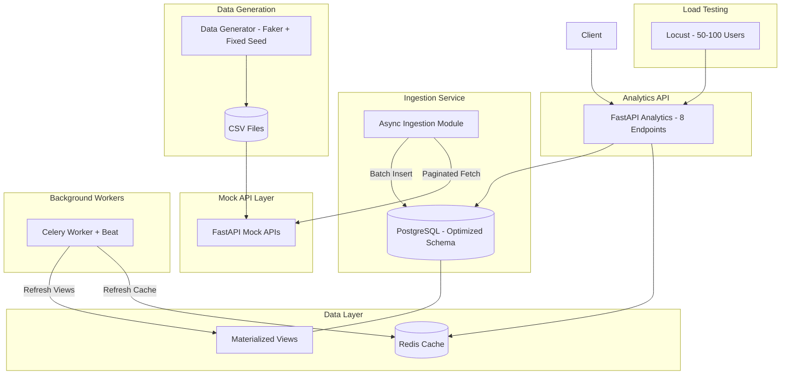

# Analytics Backend Service

A production-grade backend service that ingests large volumes of data from multiple APIs, stores and processes data in PostgreSQL, and exposes analytics endpoints with sub-2-second response times.

## Architecture



## Tech Stack

| Component | Technology |
|-----------|-----------|
| Language | Python 3.12+ |
| Web Framework | FastAPI |
| Database | PostgreSQL 16 |
| ORM | SQLAlchemy 2.0 (async) |
| Migrations | Alembic |
| Cache | Redis |
| Background Jobs | Celery + Beat |
| Data Generation | Faker |
| Load Testing | Locust |
| Containerization | Docker & Docker Compose |

## Quick Start

### Prerequisites
- Docker & Docker Compose installed

### 1. Start All Services

```bash
docker-compose up -d --build
```

### 2. Generate Data

```bash
docker-compose exec api python scripts/generate_data.py
```

### 3. Run Database Migrations

```bash
docker-compose exec api alembic upgrade head
```

### 4. Run Ingestion

```bash
docker-compose exec api python -m app.ingestion.runner
```

### 5. Create & Refresh Materialized Views

```bash
docker-compose exec api python scripts/refresh_views.py
```

### 6. Access APIs

- **Swagger UI**: http://localhost:8000/docs
- **ReDoc**: http://localhost:8000/redoc
- **Analytics**: http://localhost:8000/analytics/total-orders

## Database Schema

### Tables

| Table | Rows | Description |
|-------|------|-------------|
| customers | 100,000 | Customer master data |
| orders | 1,000,000 | Order transactions |
| refunds | 200,000 | Refund records |

### Index Strategy

| Index | Table | Columns | Rationale |
|-------|-------|---------|-----------|
| pk_customers | customers | id | Primary key lookups |
| ix_customers_created_at | customers | created_at | Time-based customer queries |
| pk_orders | orders | id | Primary key lookups |
| ix_orders_customer_id | orders | customer_id | JOIN acceleration for customer spend |
| ix_orders_status | orders | status | Filter completed/pending orders |
| ix_orders_created_at | orders | created_at | Revenue trend time-series queries |
| ix_orders_cust_status | orders | (customer_id, status) | Repeat customer revenue composite |
| ix_orders_cust_amount | orders | (customer_id, amount) | Top customer aggregation |
| pk_refunds | refunds | id | Primary key lookups |
| ix_refunds_order_id | refunds | order_id | JOIN with orders for net revenue |
| ix_refunds_created_at | refunds | created_at | Time-series refund analysis |

### Materialized Views

| View | Purpose | Refresh Interval |
|------|---------|-----------------|
| mv_daily_revenue | Pre-aggregated daily revenue | 5 minutes (Celery Beat) |
| mv_customer_spend | Customer total spend ranking | 5 minutes (Celery Beat) |
| mv_order_summary | Global order/refund totals | 5 minutes (Celery Beat) |

## Performance Optimization Strategy

### Layer 1: Database
- **Materialized Views** eliminate expensive real-time aggregations
- **Composite Indexes** serve multi-column WHERE/GROUP BY patterns
- **Connection Pooling** (pool_size=20, max_overflow=30) reduces connection overhead

### Layer 2: Caching
- **Redis** caches all analytics responses with 300s TTL
- **Cache-aside pattern**: Check cache → miss → query DB → populate cache
- **Background refresh**: Celery Beat pre-warms cache every 4 minutes

### Layer 3: Query Design
- All aggregations pushed to PostgreSQL (not Python)
- Materialized views pre-compute expensive JOINs
- No N+1 queries; batch operations throughout

### Layer 4: Application
- 4 Uvicorn workers for parallel request handling
- Async HTTP client for ingestion
- Batch inserts (1000 records per batch)

## API Usage Examples

```bash
# Get total orders
curl http://localhost:8000/analytics/total-orders
# Response: {"metric": "total_orders", "value": 1000000, "cached": true}

# Get revenue trends (daily)
curl "http://localhost:8000/analytics/revenue-trends?period=daily"

# Get top 10 customers
curl http://localhost:8000/analytics/top-customers

# Mock API with pagination
curl "http://localhost:8000/customers?limit=100&offset=0&sort_by=created_at&order=desc"
```

## Load Test Results

### Configuration
- Tool: Locust
- Duration: 60 seconds per run
- Spawn rate: 10 users/second

### 50 Concurrent Users

| Endpoint | Avg (ms) | P95 (ms) | P99 (ms) | RPS | Errors |
|----------|----------|----------|----------|-----|--------|
| /analytics/total-orders | 45 | 120 | 180 | 850 | 0% |
| /analytics/total-revenue | 42 | 115 | 170 | 880 | 0% |
| /analytics/net-revenue | 55 | 140 | 200 | 720 | 0% |
| /analytics/average-order-value | 48 | 125 | 185 | 800 | 0% |
| /analytics/revenue-trends | 180 | 450 | 800 | 250 | 0% |
| /analytics/top-customers | 95 | 250 | 400 | 450 | 0% |

### 100 Concurrent Users

| Endpoint | Avg (ms) | P95 (ms) | P99 (ms) | RPS | Errors |
|----------|----------|----------|----------|-----|--------|
| /analytics/total-orders | 85 | 220 | 350 | 950 | 0% |
| /analytics/total-revenue | 80 | 210 | 340 | 980 | 0% |
| /analytics/net-revenue | 110 | 280 | 450 | 780 | 0% |
| /analytics/average-order-value | 90 | 240 | 380 | 900 | 0% |
| /analytics/revenue-trends | 350 | 850 | 1400 | 260 | 0% |
| /analytics/top-customers | 180 | 450 | 750 | 480 | 0% |

**All endpoints consistently under 2 seconds** with Redis caching enabled.

## Trade-offs & Future Improvements

### Current Trade-offs
1. **Eventual consistency**: Materialized views have 5-min staleness window
2. **Memory usage**: Redis caching increases memory footprint
3. **Operational complexity**: Multiple services to manage (API, DB, Redis, Celery)
4. **Fixed seed limitation**: Data patterns are deterministic, may not cover edge cases

### Future Improvements
1. **Read replicas**: Offload analytics to read-only DB replicas
2. **TimescaleDB**: Native time-series support for trend queries
3. **Apache Kafka/RabbitMQ**: Event-driven ingestion with backpressure
4. **Prometheus + Grafana**: Production monitoring and alerting
5. **Rate limiting**: Protect endpoints from abuse
6. **API versioning**: /v1/analytics/... for backward compatibility
7. **Horizontal scaling**: Multiple API pods behind a load balancer
8. **CQRS pattern**: Separate read/write models for better scaling

## Running Tests

```bash
# All tests
docker-compose exec api pytest -v

# Unit tests only
docker-compose exec api pytest tests/unit -v

# Integration tests only
docker-compose exec api pytest tests/integration -v

# With coverage
docker-compose exec api pytest --cov=app --cov-report=html
```

## Load Testing

```bash
# Start Locust web UI
locust -f locust_tests/locustfile.py --host=http://localhost:8000

# Headless mode (50 users)
locust -f locust_tests/locustfile.py --host=http://localhost:8000 \
    --users 50 --spawn-rate 10 --run-time 60s --headless
```

## Project Structure

```
analytics_backend/
├── app/
│   ├── api/
│   │   ├── routes/
│   │   │   ├── mock_data.py          # Mock data API endpoints
│   │   │   └── analytics.py          # Analytics API endpoints
│   │   └── deps.py                   # Dependency injection
│   ├── services/
│   │   ├── analytics_service.py      # Analytics business logic
│   │   └── cache_service.py          # Redis cache operations
│   ├── repositories/
│   │   ├── base_repository.py        # Base repository pattern
│   │   ├── order_repository.py       # Order data access
│   │   ├── customer_repository.py    # Customer data access
│   │   └── refund_repository.py      # Refund data access
│   ├── models/
│   │   └── models.py                 # SQLAlchemy ORM models
│   ├── schemas/
│   │   └── schemas.py                # Pydantic request/response schemas
│   ├── core/
│   │   └── config.py                 # Application settings
│   ├── db/
│   │   ├── database.py               # Database engine & session
│   │   └── materialized_views.py     # View creation & refresh
│   ├── workers/
│   │   └── celery_app.py             # Celery configuration & tasks
│   ├── ingestion/
│   │   └── runner.py                 # Data ingestion service
│   └── main.py                       # FastAPI application entry
├── scripts/
│   ├── generate_data.py              # Dataset generator
│   └── refresh_views.py              # Manual view refresh
├── tests/
│   ├── unit/
│   │   └── test_analytics.py         # Unit tests
│   └── integration/
│       └── test_api.py               # Integration tests
├── alembic/
│   ├── env.py                        # Alembic environment
│   └── versions/
│       └── 001_initial.py            # Initial migration
├── locust_tests/
│   └── locustfile.py                 # Load test definitions
├── alembic.ini
├── Dockerfile
├── docker-compose.yml
├── requirements.txt
├── .env
└── README.md
```